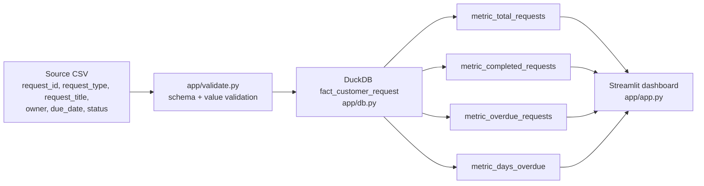

# Lineage Documentation

## Metric-to-Source Traces

All four metrics trace through the same single path — there is one source, one table, and one set of canonical queries (`METRIC_LOGIC.md`, implemented in `app/metrics.py`):

Column-level lineage: every column surfaced on the dashboard (`request_id`, `request_type`, `request_title`, `owner`, `due_date`, `status`, and the derived `days_overdue`) maps 1:1 back to the same-named source CSV column, except `days_overdue`, which is derived as `DATE_DIFF('day', due_date, reference_date)` (`app/metrics.py: get_overdue_detail`) — no other transformation, join, or enrichment occurs anywhere in the pipeline.

## Table-level Lineage

- Source → Staging → Intermediate → Mart: there is no staging or intermediate layer. The accepted CSV is validated in-memory (pandas) and loaded directly into the single mart table `fact_customer_request` via `CREATE OR REPLACE TABLE ... ; INSERT INTO ...` (`app/db.py`). This is a deliberately single-hop pipeline, consistent with `PIPELINE_SPEC.md`'s "Single-table analytical model... no joins are required" (`DATA_MODEL_SPEC.md`).
- Table dependency DAG: trivial — one table, no dependencies.

- Refresh order: not applicable (single table, full-replace on each upload).

## Impact Analysis Matrix

| If this changes... | Affected metrics | Affected dashboard components | Blast radius |
|---|---|---|---|
| Source CSV schema (column renamed/removed) | All four metrics | Entire dashboard (upload would be rejected by `app/validate.py` until the schema or `app/config.py:REQUIRED_COLUMNS` is reconciled) | High — single point of failure, by design (single-table model) |
| `request_type` or `status` enum values change | `metric_completed_requests`, `metric_overdue_requests`, breakdown by Service Type | KPI cards, Service Type breakdown/filter, Overdue Request Detail | High — same reason |
| `REFERENCE_DATE` / `APP_REFERENCE_DATE` changed | `metric_overdue_requests`, `metric_days_overdue` | Overdue KPI card, Overdue Request Detail | Medium — does not affect Total/Completed counts or the Service Type breakdown's total/completed columns |

Because this project has exactly one source, one table, and one dashboard, there is no scenario where only *part* of the system is affected by a schema-level source change — this is recorded honestly rather than inventing a more granular blast-radius breakdown that today's single-table architecture doesn't actually have.

## Breaking Change Impact

- Change impact assessment checklist: (1) does the change add/remove/rename a required column? (2) does it narrow an enum? (3) does it change `due_date` format? — any "yes" requires updating `app/config.py`, `app/validate.py`, `DATA_MODEL_SPEC.md`, `DATA_QUALITY.md`, and `DATA_CONTRACT.md` together, then re-running `app/tests/`.
- Downstream consumers: only the dashboard itself (`app/app.py`) and its test suite (`app/tests/`) — there are no other dashboards, reports, or AI models consuming this table (see `REPORT_SPEC.md`, `AI_MODEL_SPEC.md` is not applicable to this project).
- Migration plan: `null`; owner = Engineering Lead. No formal migration tooling exists; see `DATA_CONTRACT.md`'s Breaking Change Policy for the current (manual) process.
